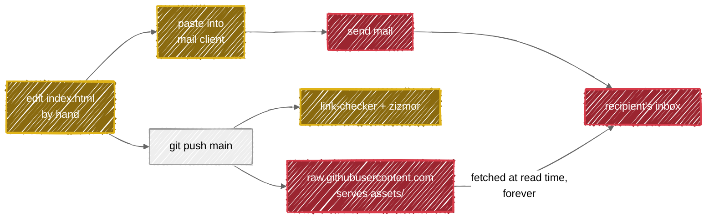

# Architecture

How this repository is put together and why. What it *is* is the [README](./README.md); the vocabulary is
[CONTEXT.md](./CONTEXT.md); how to work in it is [CLAUDE.md](./CLAUDE.md). This document does not restate
them.

## 1. Two products

There is no application here, so "architecture" means the shape of two artefacts and the obligations
attached to each. They are siblings, neither subordinate to the other
([ADR 0003](./docs/adr/0003-the-signature-and-its-assets-share-one-repository.md)).

| | **The Signature** | **The asset store** |
| --- | --- | --- |
| Is | `index.html`, a single file | `assets/images/png/`, a set of small PNGs |
| Kind | A document — finished when it renders | A service — never finished |
| Consumers | One person, pasting it into a mail client | Every message already sent |
| Contract | None. Rewrite it freely | Paths are permanent ([ADR 0002](./docs/adr/0002-published-asset-paths-are-immutable.md)) |
| Fails by | Rendering wrong in Outlook | A path going missing |
| Failure is visible | Immediately, to the sender | Never, to anyone who can fix it |

That last row is the whole reason the second column needs rules. A broken Signature is noticed the first
time it is sent; a broken Published Path is noticed only by strangers reading old mail, who will not report
it.

## 2. The delivery path

Gold is reversible, red is not. The single arrow that makes this repository unusual is the one from `raw`
to `inbox`: it is traversed every time somebody opens an old email, long after the commit that published
the file, and it is the only dependency here that cannot be updated, versioned or deprecated.

Two consequences follow directly and are worth stating before anything else:

- **A push to `main` is a publication.** There is no deploy step to hold anything back
  ([ADR 0001](./docs/adr/0001-github-raw-serves-the-assets.md)), so an accidental push cannot be taken back
  by reverting it — the URL was live in between.
- **The repository's identity is part of the contract.** Owner, name, default branch and public visibility
  all appear in the published URLs, so renaming, transferring, or making this repository private breaks
  sent mail exactly as deleting a file would.

## 3. The Signature

`index.html` is a single tree of nested `<table role="presentation">` elements with every style written
inline, because that is the only construction a mail client can be trusted with
([ADR 0004](./docs/adr/0004-email-clients-dictate-the-markup.md)). Read as a web page it is indefensible;
it is not a web page.

Its structure, top to bottom:

| Region | Holds |
| --- | --- |
| Wrapper table (`width="550"`) | Everything. Fixed width — mail clients do not do responsive reliably |
| Left cell | The avatar, 120px, circular via `border-radius`, fetched from GitHub's avatar service |
| Right cell, rows 1–2 | Name, then role and employer, with a `border-bottom` acting as a rule |
| Right cell, rows 3–4 | Phone and personal site — the two Contact Links with generic icons |
| Right cell, final row | A row of social Contact Links, each an icon-only `<a>` in its own cell |

Every `` carries an `alt`, and that is load-bearing rather than polite: mail clients block remote
images by default, so the Alt Text is what most recipients see first, and it is the entire fallback if the
assets ever stop being served.

The avatar is the one image **not** served from this repository — it comes from
`avatars.githubusercontent.com`, so it changes whenever the GitHub profile picture changes, without a
commit here. That is convenient and entirely outside this repository's control.

The repository's own icons are referenced in two different URL forms — the social ones via a
`github.com/…/blob/…?raw=true` redirect, the rest directly from `raw.githubusercontent.com`. Both are
published and neither can now be changed ([ADR 0001](./docs/adr/0001-github-raw-serves-the-assets.md)).

## 4. There is no build

`index.html` is source and artefact at once. No generator, no template, no inliner, no package manager, no
lockfile, no dependencies — cloning gives a complete working copy, and the only "build" is opening the file
([ADR 0005](./docs/adr/0005-no-build-step.md)).

The Preview, `assets/images/output/index.png`, is likewise a hand-taken screenshot uploaded by hand. It is
shown in the README and nothing checks that it still matches the Signature; keeping it in step is a human
obligation, recorded in [CLAUDE.md](./CLAUDE.md). In practice it has been honoured — both times the
Signature changed, the Preview followed within four minutes.

Correctness here cannot be automated in any case. "Renders in Outlook" is not a property any generator
produces or any CI step asserts, so the only real test is sending the thing to a real client.

## 5. Automation

Four workflows, no build among them. Every third-party action is pinned to a commit SHA with the version
as a trailing comment, and updated by Renovate under an automerge policy graded by blast radius
([ADR 0007](./docs/adr/0007-actions-are-pinned-by-digest-and-auto-merged.md)).

| Workflow | Trigger | Does |
| --- | --- | --- |
| `link-checker.yml` | push, pull request, manual | Runs lychee with `fail: true`. The only check on the delivery path. Its issue-creation step is broken — see the gotcha in [CLAUDE.md](./CLAUDE.md) |
| `zizmor.yml` | push to `main`, any pull request | Statically audits the workflow files themselves; `permissions: {}` at top level, narrowed per job |
| `renovate-auto-approve.yml` | pull request opened/synchronised/reopened/labelled | Approves Renovate pull requests labelled `patch-update`, `minor-update`, `pin-update` or `lock-maintenance`, once |
| `dependabot-auto-merge.yml` | pull request opened/synchronised | Approves and squash-merges Dependabot patch/minor/dev/indirect updates; comments and labels on major |

`.lycheeignore` exempts four hosts — Reddit, Medium, Unsplash and LinkedIn — because they defend against
bots and answer CI with `403` or another `4xx`. Those links are therefore never verified at all: if one
dies for real, nothing notices.

Renovate is the bot doing the work (`.github/renovate.json`: digest pinning, a four-day `minimumReleaseAge`,
runs on the 1st and 15th, vulnerability alerts at any time). Dependabot has an auto-merge workflow but **no
`.github/dependabot.yml`**, so it raises only the security updates GitHub creates on its own.

## 6. Decision records

The documents above are **what** and **how**. [docs/adr/](./docs/adr/) is **why**:

| ADR | Decision |
| --- | --- |
| [0001](./docs/adr/0001-github-raw-serves-the-assets.md) | GitHub raw serves the assets |
| [0002](./docs/adr/0002-published-asset-paths-are-immutable.md) | Published asset paths are immutable |
| [0003](./docs/adr/0003-the-signature-and-its-assets-share-one-repository.md) | The Signature and its assets share one repository |
| [0004](./docs/adr/0004-email-clients-dictate-the-markup.md) | Email clients dictate the markup |
| [0005](./docs/adr/0005-no-build-step.md) | No build step |
| [0006](./docs/adr/0006-cc0-1-0-licence.md) | CC0-1.0 licence |
| [0007](./docs/adr/0007-actions-are-pinned-by-digest-and-auto-merged.md) | Actions are pinned by digest and auto-merged |

Every one of them follows [0000, the template](./docs/adr/0000-adr-template.md) — `# N. Title`, a date, a
status, then *Context*, *Decision*, *Consequences*. A new ADR starts by copying that file, not by writing
one from scratch, and is written only when the decision is **hard to reverse**, **surprising without
context** and **the result of a real trade-off**.

| Document | Covers |
| --- | --- |
| [README.md](./README.md) | What this is, and the Preview |
| [CONTEXT.md](./CONTEXT.md) | Domain vocabulary, split into the two contexts of §1 |
| [ARCHITECTURE.md](./ARCHITECTURE.md) | This file: the two products, the delivery path, the ADR index |
| [CLAUDE.md](./CLAUDE.md) | Working rules, the maintenance contract, gotchas |
| [docs/adr/](./docs/adr/) | Why each irreversible decision was made, and what it cost |
